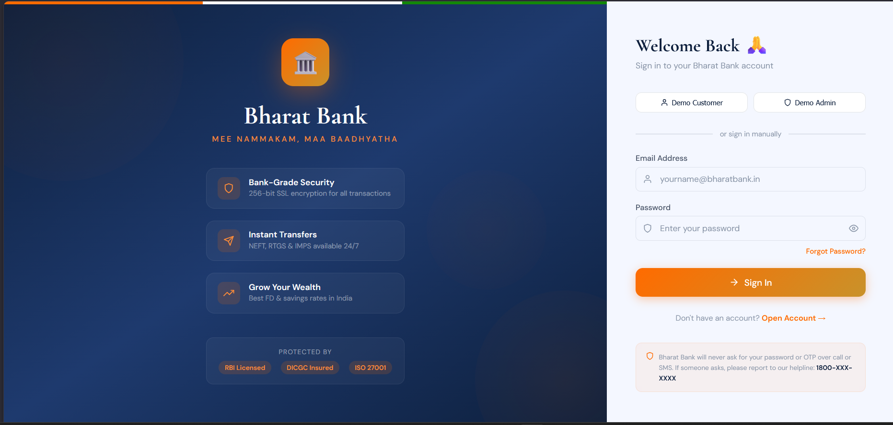
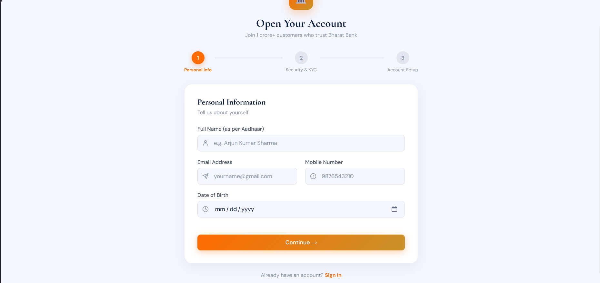
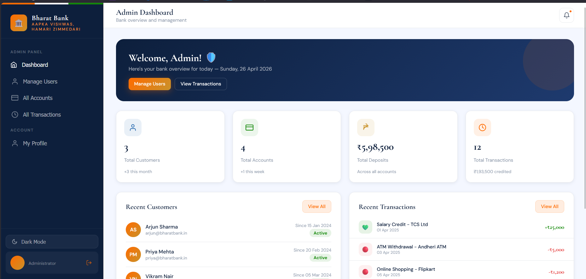
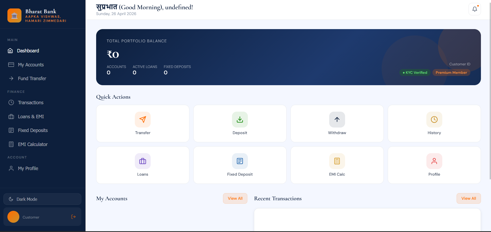
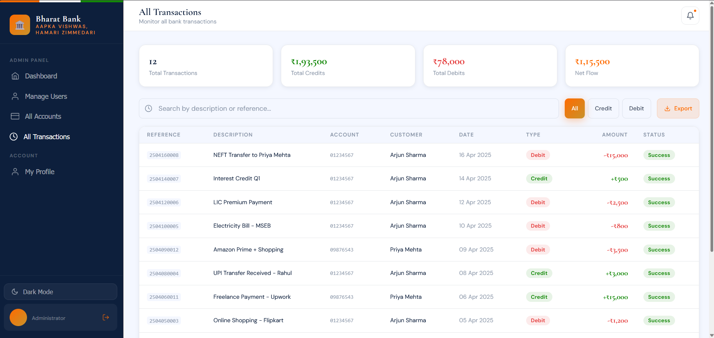

# Bharat Bank - Full Stack Banking Application

##  Project Overview

**Bharat Bank** is a full-stack web application that simulates a modern digital banking system. It allows users to register, log in, manage accounts, and perform basic banking operations through a secure and user-friendly interface.

This project is built using **React (Frontend)** and **Node.js + Express (Backend)** with optional **MongoDB Atlas integration**.

---

##  Features

###  User Features

* User Registration (Multi-step form)
* Secure Login System
* Demo Login (Admin & Customer)
* Account Creation (Savings / Current)
* Form validation (Email, Phone, PAN, Aadhaar)

###  Banking Features

* View Account Details
* Deposit / Withdraw (mock or backend-ready)
* Fund Transfer (basic logic)
* Transaction Tracking (API-ready)

###  Admin Features

* Admin Login
* Dashboard access (based on role)

---

##  Tech Stack

### Frontend:

* React (Vite)
* JavaScript (ES6)
* CSS / Inline Styling
* Context API (State Management)

### Backend:

* Node.js
* Express.js
* MongoDB (Atlas)
* Mongoose

### Tools:

* Nodemon
* dotenv
* Postman (for API testing)

---

##  Project Structure

```
BharatBank-App/
│
├── bharatbank/        # Frontend (React)
│   ├── src/
│   │   ├── pages/
│   │   ├── context/
│   │   ├── components/
│   │   └── data/
│
├── backend/           # Backend (Node + Express)
│   ├── routes/
│   ├── models/
│   ├── config/
│   ├── controllers/
│   ├── server.js
│   └── .env
```

---

##  Installation & Setup

### 1️ Clone Repository

```bash
git clone https://github.com/bhavanalambu/bharat-bank.git
cd BharatBank-App
```

---

### 2️ Backend Setup

```bash
cd backend
npm install
```

Create `.env` file:

```env
MONGO_URI=your_mongodb_connection_string
PORT=5000
```

Run backend:

```bash
npm run dev
```

---

### 3️ Frontend Setup

```bash
cd ../bharatbank
npm install
npm run dev
```

---

##  Demo Credentials

###  Admin

```
Email: admin@bharatbank.in
Password: admin123
```

###  Customer

```
Email: arjun@bharatbank.in
Password: password123
```

---

##  API Endpoints

| Method | Endpoint            | Description      |
| ------ | ------------------- | ---------------- |
| POST   | /api/users/login    | Login user       |
| POST   | /api/users/register | Register user    |
| GET    | /api/accounts       | Get accounts     |
| GET    | /api/transactions   | Get transactions |

---

##  Important Notes

* MongoDB Atlas must be configured correctly
* `.env` file must be placed in backend root
* Passwords are currently stored in plain text (for demo purposes)
* Backend uses dummy data unless MongoDB is fully integrated

---

##  Future Improvements

* JWT Authentication
* Password Hashing (bcrypt)
* Real-time transactions
* Full database integration
* Admin panel enhancements
* Mobile responsiveness improvements

---

##  Screenshots

* Login Page

* Register Page

* Dashboard:ADMIN


* Dashboard:CUSTOMER

* Transaction Page



---

##  Academic Use

This project is suitable for:

* Software Engineering Projects
* Full Stack Development Practice
* College Mini/Major Projects

---

##  License

This project is for educational purposes only.

---

##  Acknowledgment

Developed as part of a learning project to understand full-stack web development and banking system workflows.
## TEAM
L.BHAVANA
V.MOUNIKA
G.ALEKHYA
M.GOWTHAM
M.PRANITH RAJ
---
